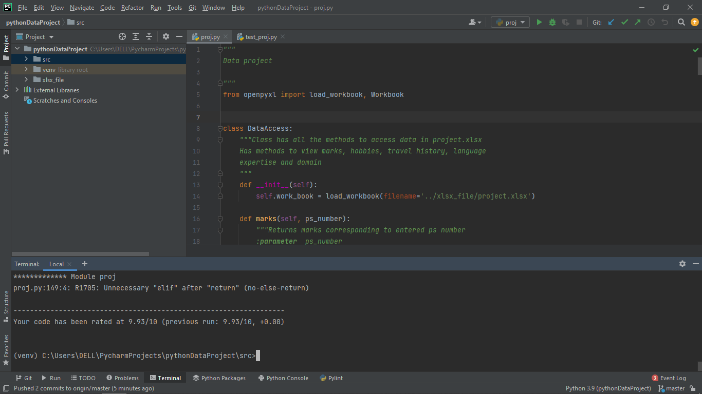
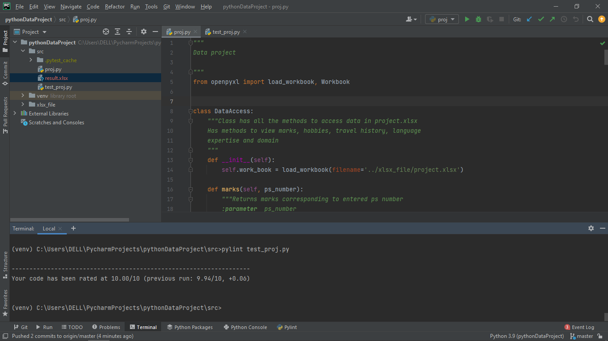
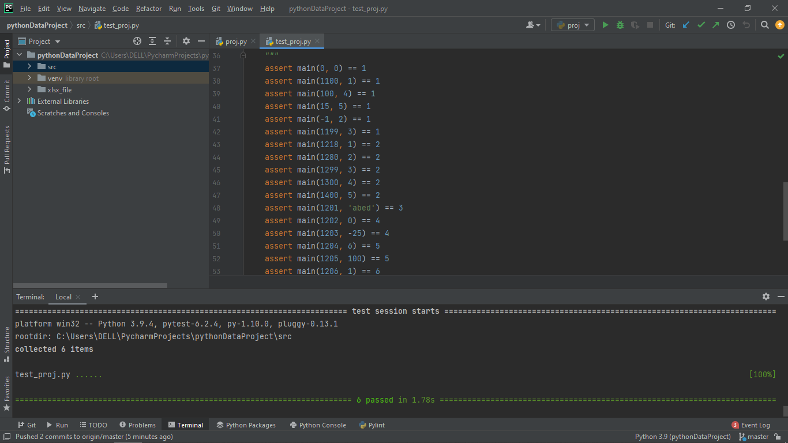
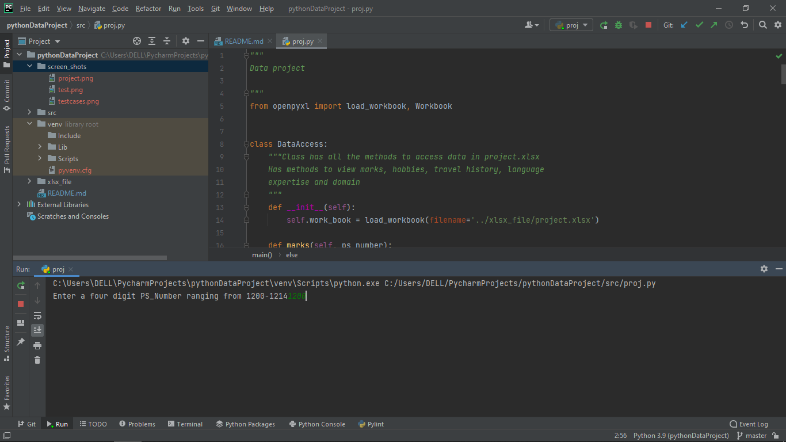
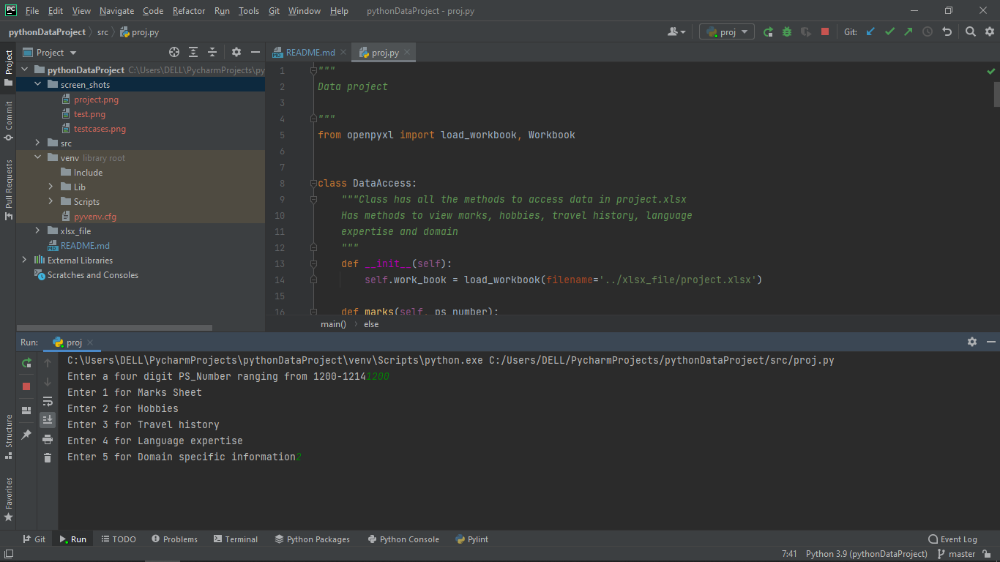
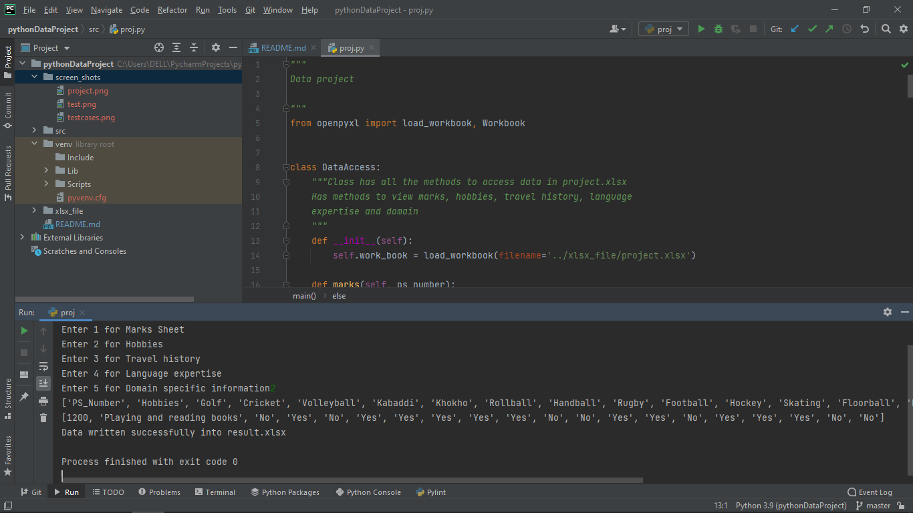

# 99004501
##Folder Structure
|Folder|Description|
|------|-----------|
|src|Contains the source code file "proj.py" and test cases file "test_proj.py" and a "result.xlsx" file will be generated once the code is executed.|
|xlsx_file| It contains a file "project.xlsx" which has five sheets with PS_Number as common in all of them. Each sheet has 15 PS_Numbers which range between 1200-1214.|
|screen_shots| Contains screenshots of execution, pylint score and pytest.|

##Pylint Score
###For proj.py
####9.93/10

###For test_proj.py
####10/10

##Pytest
####All the test cases were passed.

##Execution of project
### Run the file "proj.py" in "src" folder to start the execution of the project.
####Once the execution is started
####The terminal prompts to enter a PS Number between 1200-1214 .

####The moment the user enters a valid a PS Number it asks to select the sheet out of 5 sheets that are available.

####Then it retrieves the data from "project.xlsx" in "xlsx_file" folder, prints it and writes the retrieved data into "result.xlsx"
####The "result.xlsx" file is created in "src" folder.
